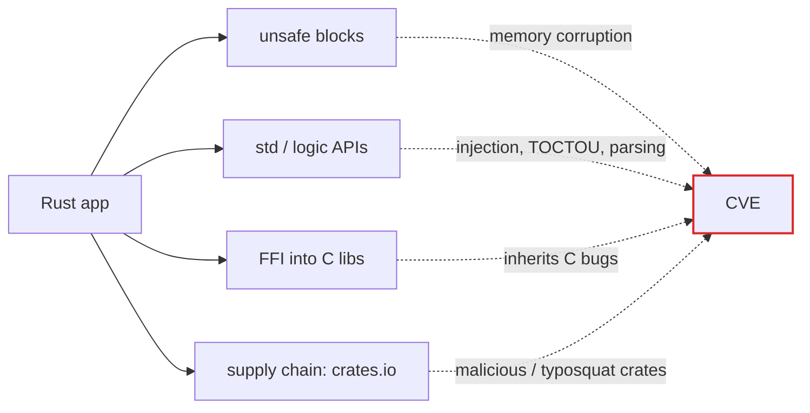

## Idea
- Rust marketing says "safe language". Reality: Rust code still gets CVEs, every year, hundreds of advisories.
- BUT be exact when you argue: Rust only claims **memory safety in safe code**. It never claimed "no bugs". The data below shows both sides.

## The numbers (as of 2026-09-18)
- **RustSec advisory DB** (official DB for crates.io): 280+ advisories in 2026 alone (IDs run past RUSTSEC-2026-0286), ~150+ in 2025, ~40+ visible for 2024. Total DB = many hundreds since 2016.
- **Rust itself (rust-lang: compiler, std, cargo)**: ~37 CVEs recorded by Sept 2024, first one 2018. Not zero. The *language project itself* has CVEs.
- **RUDRA study (SOSP 2021, Georgia Tech)**: one static tool scanned all 43k crates in 6.5 hours → found **264 new memory-safety bugs** → **76 CVEs + 112 RustSec advisories**. That was **51.6% of ALL memory-safety bugs ever reported to RustSec since 2016**. Two bugs were in std, one in the official futures lib, one in rustc.
  - Meaning: even Rust experts write memory-safety bugs, and most were never found by humans.
- **Academic paper** "Memory-Safety Challenge Considered Solved? An Empirical Study with All Rust CVEs" (Xu et al.) — studied all Rust memory-safety CVEs. Conclusion: they exist, nearly all pass through `unsafe` code.

## Hall of shame — worst Rust CVEs
- **CVE-2024-24576 "BatBadBut"** — Rust **std library**, `Command` API. Windows batch-file argument escaping broken → **arbitrary command injection. CVSS 10.0 — maximum possible score.** Fixed in Rust 1.77.2. A memory-safe language shipped a CVSS 10.
- **CVE-2023-26489** — **wasmtime** (flagship Rust WebAssembly sandbox). Cranelift computed 35-bit address instead of 33-bit → guest reads/writes up to ~34 GB past linear memory → **sandbox escape. CVSS 9.9.**
- **RUSTSEC-2026-0096** — wasmtime again, another sandbox-escaping memory access (Winch backend). Same product, new year, same bug class.
- **CVE-2022-21658** — Rust **std**, `fs::remove_dir_all` symlink race (TOCTOU) → delete files you should not touch.
- **CVE-2021-29922** — Rust **std**, `std::net` parsed leading-zero IPs wrong (octal confusion) → IP allowlist / SSRF bypass.
- **CVE-2022-46176** — **cargo** never verified SSH host keys → MITM on git dependencies.
- **RUSTSEC-2026-0285** — **rustls** (the "safe" TLS lib) TLS 1.3 issue, 2026.
- Pattern: std, cargo, wasmtime, rustls = the crown jewels of the ecosystem. All had real CVEs.

## Where Rust vulns come from

- `unsafe` keyword = memory-safety guarantee OFF. Rudra proved the ecosystem is full of it.
- Logic bugs (BatBadBut, IP parsing, SSH keys) don't care about the borrow checker at all.
- Every `-sys` crate wraps C. Rust app linking OpenSSL/libpng inherits their CVEs.
- RustSec also tracks **malicious crates** pulled from crates.io (typosquats, backdoors).

## Honest counter-side (know it before you argue)
- Most RustSec advisories = DoS/panic/unmaintained-crate, not RCE. Severity mix is milder than C/C++.
- Google Android data: memory-safety vulns dropped sharply as Rust code replaced C/C++. Microsoft: ~70% of their C/C++ CVEs were memory safety. Rust removes *that class* mostly, not all classes.
- So the winning argument is NOT "Rust has zero value". It is:
  1. "Memory safe" ≠ "secure". Injection, logic, crypto, supply chain, sandbox-escape CVEs all survive the borrow checker.
  2. Even the memory-safety promise leaks through `unsafe`, std bugs, and FFI.
  3. A CVSS 10.0 in the standard library kills the "just rewrite it in Rust and you're safe" slogan.

## How to get the FULL list yourself (it's too long for one note)
- All CVEs cannot fit in a note — hundreds of entries. Live sources:
  - rustsec.org/advisories — every crates.io advisory, one page.
  - cvedetails.com → vendor `rust-lang` — CVEs in the language/toolchain itself.
  - osv.dev → ecosystem `crates.io` — machine-readable, biggest coverage.
  - GitHub Advisory Database → filter ecosystem "Rust".
  - `cargo install cargo-audit && cargo audit` — checks any Rust project against RustSec.

## Why it matters
- Ammo for "language choice ≠ security posture" arguments.
- Vuln-research angle: Rust ecosystem is UNDER-audited. Rudra alone doubled the memory-safety advisory count with one tool → open field for new CVEs (fits the goal in [[Embedded security roadmap aims at a first hacking job and CVEs]]).
- Grep targets for bug hunting: `unsafe` blocks, `-sys` crates, wasmtime-style JIT/codegen, argument passing to shells.

## Links
- [[Embedded security roadmap aims at a first hacking job and CVEs]]
- [[Binary Exploitation]]
- [[Phase 3 learns fuzzing and vuln-research methodology]]

## Source
- https://rustsec.org/advisories/
- https://www.cvedetails.com/vendor/19029/Rust-lang.html
- https://cve.akaoma.com/vendor/rust-lang (37 CVEs count, 2018→Sept 2024)
- https://nvd.nist.gov/vuln/detail/cve-2024-24576 + https://thehackernews.com/2024/04/critical-batbadbut-rust-vulnerability.html
- https://github.com/advisories/GHSA-ff4p-7xrq-q5r8 (wasmtime CVSS 9.9)
- https://bytecodealliance.org/articles/wasmtime-security-advisories (April 2026 advisories)
- RUDRA paper: https://gts3.org/assets/papers/2021/bae:rudra.pdf (SOSP '21)
- Xu et al.: https://www.semanticscholar.org/paper/4fb1925f85ddfd7e1202f9ac392a0f446878e25b
